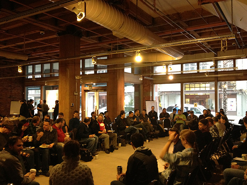
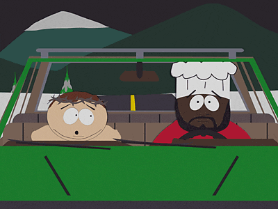
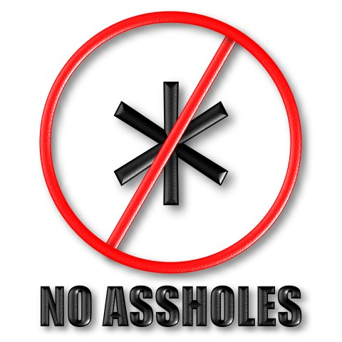

# Ignite the Chef Community!

Let's Make the Chef Community Even
Awesomer

# Infrastructure as code . . .

Community as Colleagues

                                         
# Business Value of Community

# What next?

CAMS

 
the S in CAMS stands for Sharing

* Share your story
* Share your problems
* Share your solutions

# Don't be afraid of Meatspace

* Go to LISA
* local SAGE
* XYZ sysadmin conference
* devops/sysadmin meetup
* Traveling? Offer to speak at the local geek meetup in Hong Kong, Kuala Lumpur, Hyderabad

# The Ugly Truth

LEFT BEHIND

# Golden Rule

 

# Be Nice

 

Jesse and Adam are nice

So We Are Too

# Listen

Be sure to listen to the FoodFightShow!

